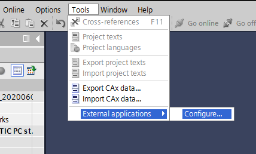
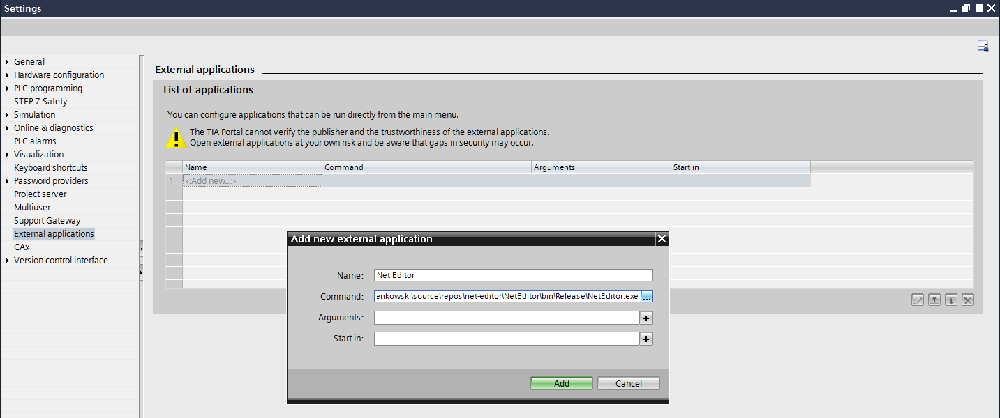
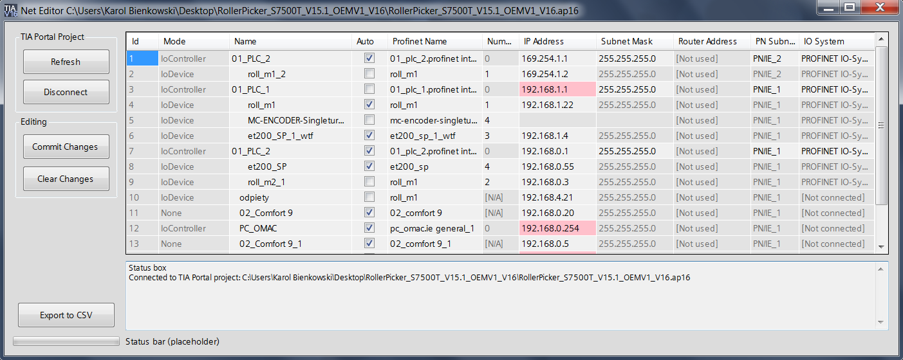

# OpennessProfinetEditor

**Scroll down for English readme.**

Aplikacja TIA Openness od szybkiej edycji sieciowych parametrów urządzeń.

## Instalacja

Program można pobrać klonując to repozytorium i kompilując je w Visual Studio, lub pobierając stąd gotowy plik wykonywalny.
Plik wykonywalny korzysta z biblioteki Openness w wersji 16, ale projekt powinien dać się skompilować także pod 15.1.
Po kompilacji sklonowanego projektu, plik NetEditor.exe powinien być dostępny w katalogu `NetEditor\bin\Release\`.

W TIA Portalu, przejdź do `Tools` -> `External applications` -> `Configure...`

Wprowadź ścieżkę do NetEditor.exe przy polu `Command:`. 

## Używanie

Aby uruchomić OpennessProfinetEditor, przejdź do `Tools` -> `External applications` -> `NetEditor`.

W tabeli urządzeń można edytować każdą aktywną komórkę. Zmiany są przenoszone do projektu TIA Portal, ale nie są finalne, dopóki nie klikniesz `Commit Changes`. Nawet po dokonaniu zmian w projekcie, wszystkie zmiany mogą być cofnięte w TIA Portalu przez funkcję `undo` (lub `ctrl+z`).

Czerwone tło pod adresem IP oznacza, że ten adres został już użyty w innym miejscu w projekcie.

Pole statusu rejestruje wszystkie zmiany wykonane w konfiguracji, oraz informuje o innych wydarzeniach.

### Przyciski

`Connect` / `Refresh` : połącz z otwartym projektem TIA Portal, lub odśwież go, jeśli jakieś zmiany nie zostały zawarte w tabeli.
Aby się połączyć, musisz zezwolić na to w wyskakującym w TIA Portalu oknie. TIA Portal przejdzie w tryb wyłącznego dostępu (Exclusive Access) i tylko OpennessProfinetEditor będzie mógł wtedy wprowadzać zmiany do projektu.

`Disconnect` : odrzuć wszystkie niedokonane zmiany i odłącz OpennessProfinetEditor od projektu TIA Portal. Oddaje dostęp TIA Portalowi.

`Commit Changes` : zmiany wprowadzone w tabeli nie są ostateczne dopóki nie zostaną  potwierdzone tym przyciskiem.

`Clear Changes` : czyści zmiany wprowadzone w tabeli. Wymaga odświeżenia tabeli.

`Export to CSV` : tworzy plik `.csv` _na podstawie tabeli_.

-----
## English Readme

TIA Openness project for rapid editing of network-related device parameters.

## Installation

You can get the program by cloning and compiling the repository in Visual Studio or by downloading released binary.  
The binary is compiled against Openness v16 library, but the projects should also work under v15.1.  
After compiling the cloned project a NetEditor.exe will be available in `NetEditor\bin\Release\`

In TIA Portal go to `Tools` -> `External applications` -> `Configure...`

Provide path to NetEditor.exe under `Command:` control. 

## Usage

To run NetEditor go to `Tools` -> `External applications` -> `NetEditor`.

In the main device table you can edit every enabled cell. Changes are mirrored in TIA Portal project, but not final unless you click `Commit Changes`. Feel free to change anything you want. Even after commiting changes, all the changes can be undone with TIA Portal `undo` function (or ctrl+z).

Red background under IP Address means that the IP is already used somewhere in the project. In the future, red background will show all kinds of simple problems in the project configuration.

Status box at the bottom registers all changes done to configuration for your information.

### Buttons

`Connect` / `Refresh` : connect to TIA Portal open project, later refresh it if some changes aren't included in device list.  
To connect, you need to allow it in TIA Portal pop-up dialog. TIAP runs in Exclusive Access mode where only NetEditor is allowed to make changes, as long as it is connected.

`Disconnect` : discard any not commited changes and disconnect from TIA Portal project. Gives control back to TIA Portal.

`Commit Changes` : any change made in the table is not final until changes are commited to project.

`Clear Changes` : clears any changes made to project in device table. At this point it doesn't refresh the table for performance reasons. You can do it manually.

`Export to CSV` : creates a simple .csv file from the device table.

